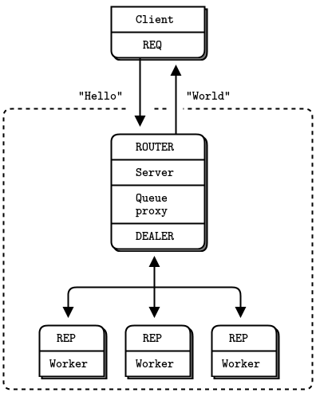

# quarkus-zeromq example

A Quarkus App implementing the Hello World Multi-thread zeromq example from the guide:

- https://zguide.zeromq.org/docs/chapter2/#Multithreading-with-ZeroMQ



Run the server
```bash
mvn quarkus:dev
```

Run the client
```bash
jbang src/main/java/org/acme/HelloWorldClient.java 
```

Build a native server
```bash
mvn package -Pnative
```
